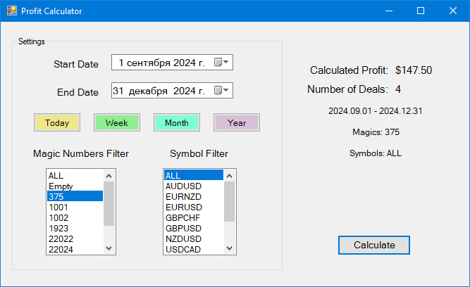

# CalculateHistoryProfit - Калькулятор исторической прибыли

## Описание / Description

**CalculateHistoryProfit** - это MQL5 скрипт для расчета исторической прибыли за указанный период с использованием графического интерфейса. Интерфейс предоставляется внешней библиотекой **MtGuiController.dll**.

**CalculateHistoryProfit** is a MQL5 script for calculating historical profit over a specified period using a graphical interface. The interface is provided by the external library **MtGuiController.dll**.



## Функциональность / Features

- ✅ **Выбор дат**: Выбор диапазона дат для расчета прибыли
- ✅ **Фильтрация по символам и магическим номерам**: Фильтрация сделок по символам и магическим номерам
- ✅ **Расчет прибыли**: Расчет общей прибыли и количества сделок на основе выбранных критериев
- ✅ **Удобный интерфейс**: Легкая навигация по опциям и просмотр результатов на графической панели
- ✅ **Расчет максимальной просадки**: Определение максимальной просадки для групп сделок
- ✅ **Группировка по символам**: Детальная статистика по каждому символу

- ✅ **Date Selection**: Choose the date range for profit calculation
- ✅ **Symbol and Magic Filtering**: Filter trades by symbols and magic numbers
- ✅ **Profit Calculation**: Calculate total profit and the number of deals based on selected criteria
- ✅ **User-Friendly Interface**: Easily navigate through options and view results on a graphical panel
- ✅ **Maximum Drawdown Calculation**: Determine maximum drawdown for deal groups
- ✅ **Symbol Grouping**: Detailed statistics for each symbol

## Установка / Installation

1. Склонируйте или скачайте репозиторий:
   ```bash
   git clone https://github.com/yourusername/MQL5_helpers.git
   ```

2. Скопируйте содержимое папки `mql5` в соответствующие папки вашего MetaTrader 5:
   - `MQL5\Scripts`
   - `MQL5\Libraries` (Убедитесь, что файл `MtGuiController.dll` размещен здесь)

3. Откройте MetaEditor и скомпилируйте скрипт для проверки отсутствия ошибок.

1. Clone or download the repository:
   ```bash
   git clone https://github.com/yourusername/MQL5_helpers.git
   ```

2. Copy the contents of the `mql5` folder into the corresponding folder in your MetaTrader 5 directory:
   - `MQL5\Scripts`
   - `MQL5\Libraries` (Ensure the `MtGuiController.dll` file is placed here)

3. Open MetaEditor and compile the script to ensure there are no errors.

## Использование / Usage

1. Запустите MetaTrader 5
2. Запустите скрипт **CalculateHistoryProfit** из панели Navigator
3. Используйте графическую панель для выбора:
   - Начальной и конечной даты
   - Символов для фильтрации
   - Магических номеров для фильтрации
4. Нажмите кнопку **Submit** для расчета прибыли
5. Результаты, включая общую прибыль и количество сделок, будут отображены на панели

1. Start MetaTrader 5
2. Run the **CalculateHistoryProfit** script from the Navigator panel
3. Use the graphical panel to select:
   - Start and end dates
   - Symbols to filter
   - Magic numbers to filter
4. Click the **Submit** button to calculate profit
5. The results, including total profit and number of deals, will be displayed on the panel

## Особенности интерфейса / Interface Features

### Быстрые кнопки дат / Quick Date Buttons
- **Сегодня** / **Today**: Расчет за текущий день
- **Неделя** / **Week**: Расчет за текущую неделю
- **Месяц** / **Month**: Расчет за текущий месяц
- **Год** / **Year**: Расчет за текущий год

### Фильтрация / Filtering
- **Символы** / **Symbols**: Выбор конкретных торговых инструментов
- **Магические номера** / **Magic Numbers**: Фильтрация по магическим номерам советников

### Результаты / Results
- **Общая прибыль** / **Total Profit**: Суммарная прибыль за период
- **Количество сделок** / **Number of Deals**: Общее количество закрытых сделок
- **Максимальная просадка** / **Maximum Drawdown**: Максимальная просадка для каждой группы
- **Детализация по символам** / **Symbol Breakdown**: Подробная статистика по каждому символу

## Алгоритм расчета / Calculation Algorithm

1. **Выбор истории**: Загружает историю сделок за указанный период
2. **Фильтрация**: Применяет фильтры по символам и магическим номерам
3. **Группировка**: Группирует сделки по магическим номерам и символам
4. **Расчет прибыли**: Вычисляет прибыль для каждой группы сделок
5. **Расчет просадки**: Определяет максимальную просадку для каждой группы
6. **Отображение результатов**: Показывает результаты на графической панели

1. **History selection**: Loads deal history for specified period
2. **Filtering**: Applies filters by symbols and magic numbers
3. **Grouping**: Groups deals by magic numbers and symbols
4. **Profit calculation**: Calculates profit for each deal group
5. **Drawdown calculation**: Determines maximum drawdown for each group
6. **Result display**: Shows results on graphical panel

## Требования / Requirements

- MetaTrader 5
- **MtGuiController.dll** (включен в репозиторий)
- Windows (для работы DLL библиотеки)

- MetaTrader 5
- **MtGuiController.dll** (included in the repository)
- Windows (for DLL library operation)

## Дополнительная информация / Additional Information

Для получения дополнительной информации о библиотеке MtGuiController, вы можете ознакомиться со статьей Василия Соколова: [Статья на MQL5](https://www.mql5.com/ru/articles/6549).

Оригинальный репозиторий библиотеки: [MtGuiController Repository](https://github.com/PublicMqlProjects/MtGuiController).

For more information about the MtGuiController library, you can check out the article published by Vasiliy Sokolov: [Article on MQL5](https://www.mql5.com/ru/articles/6549).

You can also find the original repository of the library here: [MtGuiController Repository](https://github.com/PublicMqlProjects/MtGuiController).

## Лицензия / License

MIT License - см. файл [LICENSE](https://mit-license.org/) для подробностей.

MIT License - see the [LICENSE](https://mit-license.org/) file for details.

## Автор / Author

Создано Snail000 / Created by Snail000

## Поддержка / Support

Для вопросов и предложений создавайте Issues в репозитории.

For any questions or issues, please open an issue in the repository.
